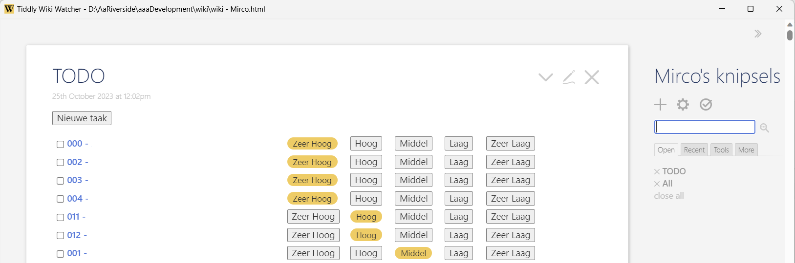

# Tiddly Wiki save Watcher
Tiddly Wiki save Watcher watches the [Tiddly Wiki](https://tiddlywiki.com/ "Tiddly Wiki") being saved by the browser to the Downloads folder. 
And then moves the download automatically to the original filename.

# Download binary
For Windows (.NET framework 2.0 / .NET framework 4), [the latest version can be found here](/releases/latest "Lastest Version").

Download the zip and unpack it somewhere on your computer. Then run TiddlyWikiWatcher.exe (or make a shortcut on your desktop to it).

# Commandline arguments
TiddlyWikiWatcher.exe "full-path-to-tiddly-wiki-file.html" {-autoopen}

The optional **-autoopen** automatically starts the provided **file** argument in the browser when TiddlyWikiWatcher.exe is started.

e.g. TiddlyWikiWatcher.exe "D:\AaRiverside\aaaDevelopment\wiki\wiki.html" -autoopen

# Why
Previously I used the Tiddly Wiki Chrome extension to maintain my personal wiki. 
But at some point I could not scroll anymore in the extension, because of a Google Chrome update. 
So I had to come up with something, to make the save easier. At this point Tiddly Wiki save Watcher was born.

# Contributions
Contributions are welcome. Please read [CONTRIBUTING.md](CONTRIBUTING.md "contributing") before making any contribution!

# License
[The license is MIT.](LICENSE.md "license")

The [icon](http://wlb.wikia.com/wiki/File:Wikipedia-icon.png "icon") is licensed as Attribution-ShareAlike 3.0 Unported (CC BY-SA 3.0).

The [KnownFolders.cs](https://www.codeproject.com/Articles/878605/Getting-all-Special-Folders-in-NET "KnownFolders.cs") is licensed as The Code Project Open License (CPOL).

